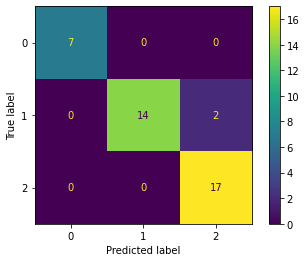
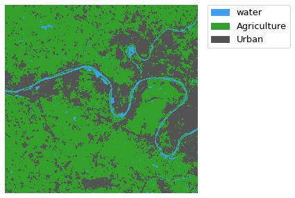

# 🛰️ Satellite Image Classification Using Machine Learning

This project performs **land cover classification** on Sentinel-2 satellite imagery using **Random Forest** and **Decision Tree** classifiers. The process includes data preparation, training, model evaluation, and classification map generation.

---

## 📌 Table of Contents

1. [Project Overview](#-project-overview)  
2. [Technologies Used](#-technologies-used)  
3. [Data Preparation](#-data-preparation)  
4. [Model Training](#-model-training)  
5. [Model Evaluation](#-model-evaluation)  
6. [Output Classification Maps](#-output-classification-maps)  
7. [Author](#-author)

---

## 🌍 Project Overview

This project demonstrates the full workflow of supervised image classification using:

- **Sentinel-2 raster imagery**
- **Labeled training data (shapefile)**
- **Random Forest** and **Decision Tree** machine learning models

It automates:

- Extracting spectral data from training points
- Training and validating models
- Applying predictions over the entire raster
- Generating output classified maps in GeoTIFF format

---

## 🧰 Technologies Used

- **Python**
- `rasterio`, `geopandas`, `pandas`, `matplotlib`, `earthpy`, `scikit-learn`
- Machine Learning: `RandomForestClassifier`, `DecisionTreeClassifier`

---

## 🗂️ Data Preparation

### ✅ Import Libraries

```python
import geopandas as gpd
import numpy as np
import rasterio
import earthpy.plot as ep
import pandas as pd
import matplotlib.pyplot as plt
from sklearn.model_selection import train_test_split
from sklearn.ensemble import RandomForestClassifier
from sklearn.tree import DecisionTreeClassifier
from sklearn.metrics import confusion_matrix, ConfusionMatrixDisplay, classification_report
```

### ✅ Load and Display Raster

```python
src = rasterio.open('inputs/T31UDQ_20220326T104639.tif')
ep.plot_rgb(arr=src.read(), rgb=(3,2,1), figsize=(5, 5))
```


---

## 🧪 Training & Validation

### ✅ Load and Sample Training Data

```python
training = gpd.read_file('inputs/training_data/data.shp')
```

### ✅ Sample Raster Pixels at Training Locations

```python
def sampling_data(gdf, src):
    coords = [(x, y) for x, y in zip(gdf.geometry.x, gdf.geometry.y)]
    values = pd.DataFrame([val for val in src.sample(coords)], 
                          columns=[f'band_{i+1}' for i in range(src.count)])
    return gdf.join(values)
```

---

## 🧠 Model Training

### ✅ Random Forest

```python
rfm = RandomForestClassifier(n_estimators=100, random_state=1)
rfm.fit(X_train, y_train)
```

### ✅ Decision Tree

```python
dtm = DecisionTreeClassifier(max_depth=2, random_state=1)
dtm.fit(X_train, y_train)
```

---

## 📊 Model Evaluation

### ✅ Random Forest Evaluation

```python
y_pred = rfm.predict(X_valid)
print(classification_report(y_valid, y_pred))
ConfusionMatrixDisplay(confusion_matrix(y_valid, y_pred)).plot()
```


### ✅ Decision Tree Evaluation

```python
y_pred = dtm.predict(X_valid)
ConfusionMatrixDisplay(confusion_matrix(y_valid, y_pred)).plot()
```



---

## 🗺️ Output Classification Maps

### ✅ Visualize Final Classified Raster (Random Forest)

```python
from matplotlib.colors import ListedColormap

classes = ["Water", "Agriculture", "Urban"]
colors = ListedColormap(['#3BA0FD', '#33A02C', '#535353'])

f, ax = plt.subplots(figsize=(10, 5))
im = ax.imshow(predicted_raster, cmap=colors)
ep.draw_legend(im, titles=classes)
ax.set_axis_off()
plt.show()
```



---

## 👨‍💻 Author

**Yasser Ismail Barhoom**  
Geospatial Engineer  
📧 [yasserism2020@gmail.com](mailto:yasserism2020@gmail.com)  
💬 WhatsApp: [+972567793729](https://wa.me/972567793729)  
🌐 GitHub: [github.com/yasser-barhoom](https://github.com/yasser-barhoom)

---
