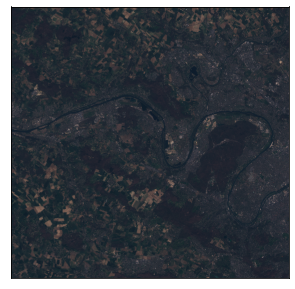
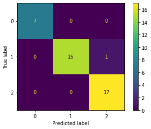
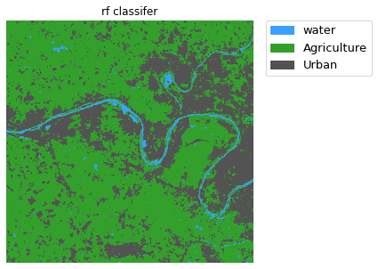
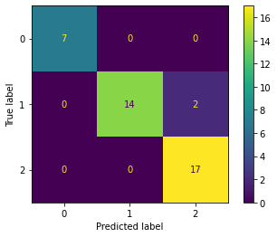
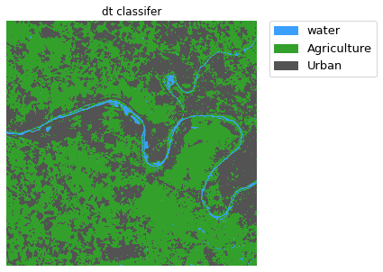

# classification a satellite image-Sentinel-2- using Random Forest algorithm
# 1.Importing libraries


```python
import geopandas as gpd
import numpy as np
import rasterio
import earthpy.plot as ep
import pandas as pd
import matplotlib.pyplot as plt
from sklearn.model_selection import train_test_split
from sklearn.ensemble import RandomForestClassifier
from sklearn.metrics import confusion_matrix,ConfusionMatrixDisplay,classification_report
from sklearn.tree import DecisionTreeClassifier
```

# 2.Getting the data

### Raster source


```python
path = r'inputs\images\T31UDQ_20220326T104639_stacked_aoi.tif'
src  = rasterio.open(path,mode='r')
ep.plot_rgb(arr=src.read(),rgb=(3,2,1),figsize =(5, 5))
```


    

    


    <AxesSubplot:>


### Raster source meatadata


```python
driver= src.driver
rows  = src.height
cols  = src.width
bands = src.count
geo_transform = src.transform
projection = src.crs
```

### Convert raster array to dataframe


```python
src_array = src.read()
```


```python
row_per_pixel = src_array.reshape([bands,-1]).T
columns = [f'band_{n}' for n in range(1,bands+1)]
row_per_pixel_df  = pd.DataFrame(row_per_pixel,columns=columns)
row_per_pixel_df.head()
```


<div>
<style scoped>
    .dataframe tbody tr th:only-of-type {
        vertical-align: middle;
    }

    .dataframe tbody tr th {
        vertical-align: top;
    }

    .dataframe thead th {
        text-align: right;
    }
</style>
<table border="1" class="dataframe">
  <thead>
    <tr style="text-align: right;">
      <th></th>
      <th>band_1</th>
      <th>band_2</th>
      <th>band_3</th>
      <th>band_4</th>
      <th>band_5</th>
      <th>band_6</th>
      <th>band_7</th>
      <th>band_8</th>
      <th>band_9</th>
      <th>band_10</th>
      <th>band_11</th>
      <th>band_12</th>
      <th>band_13</th>
    </tr>
  </thead>
  <tbody>
    <tr>
      <th>0</th>
      <td>2482.0</td>
      <td>2056.0</td>
      <td>1869.0</td>
      <td>1557.0</td>
      <td>1922.0</td>
      <td>3816.0</td>
      <td>4760.0</td>
      <td>4751.0</td>
      <td>4995.0</td>
      <td>2511.0</td>
      <td>1021.0</td>
      <td>2398.0</td>
      <td>1609.0</td>
    </tr>
    <tr>
      <th>1</th>
      <td>2477.0</td>
      <td>2193.0</td>
      <td>2050.0</td>
      <td>1933.0</td>
      <td>2141.0</td>
      <td>2978.0</td>
      <td>3303.0</td>
      <td>3688.0</td>
      <td>3599.0</td>
      <td>2337.0</td>
      <td>1020.0</td>
      <td>2871.0</td>
      <td>2019.0</td>
    </tr>
    <tr>
      <th>2</th>
      <td>2465.0</td>
      <td>2167.0</td>
      <td>1992.0</td>
      <td>1867.0</td>
      <td>2067.0</td>
      <td>2826.0</td>
      <td>3099.0</td>
      <td>3383.0</td>
      <td>3351.0</td>
      <td>2421.0</td>
      <td>1020.0</td>
      <td>2693.0</td>
      <td>1942.0</td>
    </tr>
    <tr>
      <th>3</th>
      <td>2475.0</td>
      <td>2198.0</td>
      <td>2066.0</td>
      <td>1992.0</td>
      <td>2243.0</td>
      <td>2989.0</td>
      <td>3320.0</td>
      <td>3605.0</td>
      <td>3628.0</td>
      <td>2109.0</td>
      <td>1021.0</td>
      <td>3428.0</td>
      <td>2401.0</td>
    </tr>
    <tr>
      <th>4</th>
      <td>2483.0</td>
      <td>2196.0</td>
      <td>2052.0</td>
      <td>1963.0</td>
      <td>2197.0</td>
      <td>2896.0</td>
      <td>3152.0</td>
      <td>3478.0</td>
      <td>3423.0</td>
      <td>1941.0</td>
      <td>1021.0</td>
      <td>3265.0</td>
      <td>2278.0</td>
    </tr>
  </tbody>
</table>
</div>


### Training data


```python
path = r'inputs\training_data\data.shp'
training = gpd.read_file(path)
training.head()
```


<div>
<style scoped>
    .dataframe tbody tr th:only-of-type {
        vertical-align: middle;
    }

    .dataframe tbody tr th {
        vertical-align: top;
    }

    .dataframe thead th {
        text-align: right;
    }
</style>
<table border="1" class="dataframe">
  <thead>
    <tr style="text-align: right;">
      <th></th>
      <th>mc_id</th>
      <th>mc_info</th>
      <th>geometry</th>
    </tr>
  </thead>
  <tbody>
    <tr>
      <th>0</th>
      <td>1</td>
      <td>water</td>
      <td>POINT (408809.562 5424630.469)</td>
    </tr>
    <tr>
      <th>1</th>
      <td>1</td>
      <td>water</td>
      <td>POINT (410731.037 5424268.330)</td>
    </tr>
    <tr>
      <th>2</th>
      <td>1</td>
      <td>water</td>
      <td>POINT (411750.392 5424869.908)</td>
    </tr>
    <tr>
      <th>3</th>
      <td>1</td>
      <td>water</td>
      <td>POINT (415890.404 5426849.007)</td>
    </tr>
    <tr>
      <th>4</th>
      <td>1</td>
      <td>water</td>
      <td>POINT (417390.624 5426973.694)</td>
    </tr>
  </tbody>
</table>
</div>


# 3.Exploring data


```python
row_per_pixel_df.info()
```

    <class 'pandas.core.frame.DataFrame'>
    RangeIndex: 301365 entries, 0 to 301364
    Data columns (total 13 columns):
     #   Column   Non-Null Count   Dtype  
    ---  ------   --------------   -----  
     0   band_1   301365 non-null  float32
     1   band_2   301365 non-null  float32
     2   band_3   301365 non-null  float32
     3   band_4   301365 non-null  float32
     4   band_5   301365 non-null  float32
     5   band_6   301365 non-null  float32
     6   band_7   301365 non-null  float32
     7   band_8   301365 non-null  float32
     8   band_9   301365 non-null  float32
     9   band_10  301365 non-null  float32
     10  band_11  301365 non-null  float32
     11  band_12  301365 non-null  float32
     12  band_13  301365 non-null  float32
    dtypes: float32(13)
    memory usage: 14.9 MB
    

###### ```There are  no N/A Values```

# 4.Create train,validation and test sets

### Create test set


```python
test_set = row_per_pixel_df.copy()
```

### Sampling the training data from raster source


```python
def sampling_data(gdf,src):
    name   = gdf.geometry.name
    coords = [(x,y) for x,y in zip(gdf[name].x , gdf[name].y)]
    values = pd.DataFrame([val for val in src.sample(coords)],columns=columns)
    output = gdf.join(values,how='left',lsuffix='_gdf',rsuffix='_src')
    return output
```


```python
sampled = sampling_data(training,src)
sampled.head()
```


<div>
<style scoped>
    .dataframe tbody tr th:only-of-type {
        vertical-align: middle;
    }

    .dataframe tbody tr th {
        vertical-align: top;
    }

    .dataframe thead th {
        text-align: right;
    }
</style>
<table border="1" class="dataframe">
  <thead>
    <tr style="text-align: right;">
      <th></th>
      <th>mc_id</th>
      <th>mc_info</th>
      <th>geometry</th>
      <th>band_1</th>
      <th>band_2</th>
      <th>band_3</th>
      <th>band_4</th>
      <th>band_5</th>
      <th>band_6</th>
      <th>band_7</th>
      <th>band_8</th>
      <th>band_9</th>
      <th>band_10</th>
      <th>band_11</th>
      <th>band_12</th>
      <th>band_13</th>
    </tr>
  </thead>
  <tbody>
    <tr>
      <th>0</th>
      <td>1</td>
      <td>water</td>
      <td>POINT (408809.562 5424630.469)</td>
      <td>2492.0</td>
      <td>2138.0</td>
      <td>1846.0</td>
      <td>1553.0</td>
      <td>1496.0</td>
      <td>1443.0</td>
      <td>1431.0</td>
      <td>1276.0</td>
      <td>1325.0</td>
      <td>1161.0</td>
      <td>1013.0</td>
      <td>1181.0</td>
      <td>1155.0</td>
    </tr>
    <tr>
      <th>1</th>
      <td>1</td>
      <td>water</td>
      <td>POINT (410731.037 5424268.330)</td>
      <td>2520.0</td>
      <td>2144.0</td>
      <td>1896.0</td>
      <td>1656.0</td>
      <td>1849.0</td>
      <td>2405.0</td>
      <td>2566.0</td>
      <td>2030.0</td>
      <td>2629.0</td>
      <td>2346.0</td>
      <td>1018.0</td>
      <td>1905.0</td>
      <td>1544.0</td>
    </tr>
    <tr>
      <th>2</th>
      <td>1</td>
      <td>water</td>
      <td>POINT (411750.392 5424869.908)</td>
      <td>2500.0</td>
      <td>2261.0</td>
      <td>2028.0</td>
      <td>1846.0</td>
      <td>1710.0</td>
      <td>1689.0</td>
      <td>1719.0</td>
      <td>1780.0</td>
      <td>1640.0</td>
      <td>1196.0</td>
      <td>1016.0</td>
      <td>1601.0</td>
      <td>1518.0</td>
    </tr>
    <tr>
      <th>3</th>
      <td>1</td>
      <td>water</td>
      <td>POINT (415890.404 5426849.007)</td>
      <td>2530.0</td>
      <td>2142.0</td>
      <td>1859.0</td>
      <td>1563.0</td>
      <td>1477.0</td>
      <td>1401.0</td>
      <td>1355.0</td>
      <td>1307.0</td>
      <td>1249.0</td>
      <td>1969.0</td>
      <td>1018.0</td>
      <td>1114.0</td>
      <td>1071.0</td>
    </tr>
    <tr>
      <th>4</th>
      <td>1</td>
      <td>water</td>
      <td>POINT (417390.624 5426973.694)</td>
      <td>2683.0</td>
      <td>2103.0</td>
      <td>1816.0</td>
      <td>1519.0</td>
      <td>1648.0</td>
      <td>1840.0</td>
      <td>1881.0</td>
      <td>1448.0</td>
      <td>1876.0</td>
      <td>1856.0</td>
      <td>1021.0</td>
      <td>1450.0</td>
      <td>1260.0</td>
    </tr>
  </tbody>
</table>
</div>


### Create training and validation sets


```python
X = sampled.drop(['mc_id','mc_info','geometry'],axis=1)
y = sampled['mc_id']
```


```python
X_train, X_valid, y_train, y_valid = train_test_split(X,y,test_size=0.3,random_state=1)
```

# 5.Training the models

### Random Forest Classifier

#### ```Train the model```


```python
rfm = RandomForestClassifier(n_estimators=100,random_state=1)
rfm.fit(X_train,y_train)
```


    RandomForestClassifier(random_state=1)


#### ```Performance measure```


```python
y_hat = rfm.predict(X_valid)
conf_matrix = confusion_matrix(y_valid,y_hat,labels=rfm.classes_)
disp = ConfusionMatrixDisplay(conf_matrix)
disp.plot()
```


    <sklearn.metrics._plot.confusion_matrix.ConfusionMatrixDisplay at 0x1ffc2b87fd0>


    

    


```python
print(classification_report(y_valid,y_hat))
```

                  precision    recall  f1-score   support
    
               1       1.00      1.00      1.00         7
               2       1.00      0.94      0.97        16
               3       0.94      1.00      0.97        17
    
        accuracy                           0.97        40
       macro avg       0.98      0.98      0.98        40
    weighted avg       0.98      0.97      0.97        40
    
    


```python
test_predictions = rfm.predict(test_set)
test_predictions
```


    array([2, 2, 2, ..., 2, 2, 3], dtype=int64)


```python
test_predictions = test_predictions.astype('float64')
test_predictions
```


    array([2., 2., 2., ..., 2., 2., 3.])


```python
new_dataset = rasterio.open(r'D:\UCAS\AI\Project\out\output_rfm.tif',
            mode = 'w',
            driver=src.driver,
            height = src.shape[0],
            width = src.shape[1],
            count=1, dtype='float64',
            crs=src.crs,
            transform=src.transform)
new_dataset.write(test_predictions.reshape((rows,cols)), 1)
new_dataset.close()
```


```python
from matplotlib.colors import ListedColormap
path = r'D:\UCAS\AI\Project\out\output_rfm.tif'
src  = rasterio.open(path,mode='r')
array = src.read()[0]
classes = ["water", "Agriculture", "Urban"]
colors  = ListedColormap(['#3BA0FD','#33A02C','#535353'])
f, ax = plt.subplots(figsize=(10,5))
im = ax.imshow(array, cmap = colors)
ax.set(title="rf classifer")
ep.draw_legend(im, titles = classes)
ax.set_axis_off()
plt.show()
```


    

    


### Decision Tree Classifier

#### ```Train the model```


```python
dtm = DecisionTreeClassifier(max_depth=2,random_state=1)
dtm.fit(X_train,y_train)
```


    DecisionTreeClassifier(max_depth=2, random_state=1)


#### ```Performance measure```


```python
y_hat = dtm.predict(X_valid)
conf_matrix = confusion_matrix(y_valid,y_hat,labels=dtm.classes_)
disp = ConfusionMatrixDisplay(conf_matrix)
disp.plot()
```


    <sklearn.metrics._plot.confusion_matrix.ConfusionMatrixDisplay at 0x1e3c867bb38>


    

    


```python
test_predictions = dtm.predict(test_set)
test_predictions
```


    array([2, 2, 2, ..., 2, 2, 3], dtype=int64)


```python
test_predictions = test_predictions.astype('float64')
```


```python
new_dataset = rasterio.open(r'D:\UCAS\AI\Project\out\output_dtm.tif',
            mode = 'w',
            driver=src.driver,
            height = src.shape[0],
            width = src.shape[1],
            count=1, dtype='float64',
            crs=src.crs,
            transform=src.transform)
new_dataset.write(test_predictions.reshape((rows,cols)), 1)
new_dataset.close()
```


```python
from matplotlib.colors import ListedColormap
path = r'D:\UCAS\AI\Project\out\output_dtm.tif'
src  = rasterio.open(path,mode='r')
array = src.read()[0]
classes = ["water", "Agriculture", "Urban"]
colors  = ListedColormap(['#3BA0FD','#33A02C','#535353'])
f, ax = plt.subplots(figsize=(10,5))
im = ax.imshow(array, cmap = colors)
ax.set(title="dt classifer")
ep.draw_legend(im, titles = classes)
ax.set_axis_off()
plt.show()
```


    

    


```python
## yasser Ismail
```
