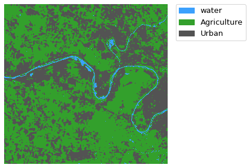

# 🛰️ Land Use Classification of Sentinel-2 Imagery Using Machine Learning

This project demonstrates a complete workflow for land cover classification using Sentinel-2 satellite imagery and machine learning algorithms, specifically **Random Forest** and **Decision Tree** classifiers.

We classify the land into three classes:
- **Water**
- **Agriculture**
- **Urban**

The process includes reading satellite data, feature extraction, training classification models, and generating prediction maps.

---

## 📦 1. Import Libraries

```python
import geopandas as gpd
import numpy as np
import rasterio
import earthpy.plot as ep
import pandas as pd
import matplotlib.pyplot as plt
from sklearn.model_selection import train_test_split
from sklearn.ensemble import RandomForestClassifier
from sklearn.metrics import confusion_matrix,ConfusionMatrixDisplay,classification_report
from sklearn.tree import DecisionTreeClassifier
````

---

## 🌐 2. Load and Explore Data

### 🛰️ Raster Source

```python
path = r'inputs\T31UDQ_20220326T104639.tif'
src  = rasterio.open(path,mode='r')
ep.plot_rgb(arr=src.read(),rgb=(3,2,1),figsize =(5, 5))
```


### 📝 Raster Metadata

```python
driver= src.driver
rows  = src.height
cols  = src.width
bands = src.count
geo_transform = src.transform
projection = src.crs
```

### 📊 Convert Raster to DataFrame

```python
src_array = src.read()
```

```python
row_per_pixel = src_array.reshape([bands,-1]).T
columns = [f'band_{n}' for n in range(1,bands+1)]
row_per_pixel_df  = pd.DataFrame(row_per_pixel,columns=columns)
row_per_pixel_df.head()
```

### 📌 Training Data (Ground Truth Points)

```python
path = r'inputs\training_data\data.shp'
training = gpd.read_file(path)
training.head()
```

---

## 🔍 3. Explore the Data

```python
row_per_pixel_df.info()
```

> There are no N/A values.

---

## 🧪 4. Create Datasets

### Create Test Set

```python
test_set = row_per_pixel_df.copy()
```

### Sample Training Data from Raster

```python
def sampling_data(gdf,src):
    name   = gdf.geometry.name
    coords = [(x,y) for x,y in zip(gdf[name].x , gdf[name].y)]
    bands = src.count
    columns = [f'band_{n}' for n in range(1,bands+1)]
    values = pd.DataFrame([val for val in src.sample(coords)],columns=columns)
    output = gdf.join(values,how='left',lsuffix='_gdf',rsuffix='_src')
    return output
```

```python
sampled = sampling_data(training,src)
sampled.head()
```

### Split into Train and Validation Sets

```python
X = sampled.drop(['mc_id','mc_info','geometry'],axis=1)
y = sampled['mc_id']
```

```python
X_train, X_valid, y_train, y_valid = train_test_split(X,y,test_size=0.3,random_state=1)
```

---

## 🌲 5. Random Forest Classifier

### Train the Model

```python
rfm = RandomForestClassifier(n_estimators=100,random_state=1)
rfm.fit(X_train,y_train)
```

### Evaluate Model

```python
y_hat = rfm.predict(X_valid)
conf_matrix = confusion_matrix(y_valid,y_hat,labels=rfm.classes_)
disp = ConfusionMatrixDisplay(conf_matrix)
disp.plot()
```


```python
print(classification_report(y_valid,y_hat))
```

### Predict Classes and Save Raster

```python
test_predictions = rfm.predict(test_set)
test_predictions = test_predictions.astype('float64')
new_dataset = rasterio.open(r'output_rfm.tif',
            mode = 'w',
            driver=driver,
            height = rows,
            width = cols,
            count=1, dtype='float64',
            crs=projection,
            transform=geo_transform)
new_dataset.write(test_predictions.reshape((rows,cols)), 1)
new_dataset.close()
```

### Visualize Classification Map

```python
from matplotlib.colors import ListedColormap
path = r'output_rfm.tif'
src  = rasterio.open(path,mode='r')
array = src.read()[0]
classes = ["water", "Agriculture", "Urban"]
colors  = ListedColormap(['#3BA0FD','#33A02C','#535353'])
f, ax = plt.subplots(figsize=(10,5))
im = ax.imshow(array, cmap = colors)
ep.draw_legend(im, titles = classes)
ax.set_axis_off()
plt.show()
```


---

## 🌳 6. Decision Tree Classifier

### Train the Model

```python
dtm = DecisionTreeClassifier(max_depth=2,random_state=1)
dtm.fit(X_train,y_train)
```

### Evaluate Model

```python
y_hat = dtm.predict(X_valid)
conf_matrix = confusion_matrix(y_valid,y_hat,labels=dtm.classes_)
disp = ConfusionMatrixDisplay(conf_matrix)
disp.plot()
```


### Predict and Save Raster

```python
test_predictions = dtm.predict(test_set)
test_predictions = test_predictions.astype('float64')
new_dataset = rasterio.open(r'output_dtm.tif',
            mode = 'w',
            driver=driver,
            height = rows,
            width = cols,
            count=1, dtype='float64',
            crs=projection,
            transform=geo_transform)
new_dataset.write(test_predictions.reshape((rows,cols)), 1)
new_dataset.close()
```

### Visualize Map

```python
from matplotlib.colors import ListedColormap
path = r'output_dtm.tif'
src  = rasterio.open(path,mode='r')
array = src.read()[0]
classes = ["water", "Agriculture", "Urban"]
colors  = ListedColormap(['#3BA0FD','#33A02C','#535353'])
f, ax = plt.subplots(figsize=(10,5))
im = ax.imshow(array, cmap = colors)
ep.draw_legend(im, titles = classes)
ax.set_axis_off()
plt.show()
```



---

## 👨‍💻 Author

**Yasser Ismail**

---
